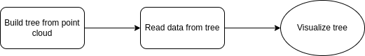

# 3D Space Partitioning: Octree Visualization

This project is a web application that allows you to build an octree from a PCD file and visualize it using OpenGL. The application consists of a Node.js frontend and a C++ backend. It was developed as part of the Computer Graphics course at Ghent University.

## Table of Contents

- [3D Space Partitioning: Octree Visualization](#3d-space-partitioning-octree-visualization)
  - [Table of Contents](#table-of-contents)
  - [Overview](#overview)
  - [Installation](#installation)
  - [Usage](#usage)
  - [Algorithm: Octree](#algorithm-octree)
  - [Future Improvements](#future-improvements)
  - [License](#license)

## Overview

The main objective of this project is to provide an interactive tool to build and visualize octrees from point cloud data (PCD) files. The frontend is developed using SvelteKit and Three.js, while the backend is written in C++. The graph below shows the high-level implementation, where the backend handles the construction and traversal of the tree, while the frontend handles the visualization.



## Installation

To get started, ensure you have Node.js installed and the means to build a C++ project using CMake. Follow the steps below to set up the project:

1. **Clone the repository:**

    ```bash
    git clone https://github.com/togalle/octree-visualization.git
    cd octree-visualization
    ```

2. **Build the C++ backend:**

    ```bash
    cd cpp-backend
    mkdir build
    cd build
    cmake ..
    make
    cd ..
    ```

3. **Start the application:**

    - On Linux, you can use the provided script to start both servers:

        ```bash
        ./start.sh
        ```

    - On Windows, may God save your soul o7

## Usage

1. Open your web browser and navigate to [`http://localhost:5173`](http://localhost:5173).
2. Upload a PCD file using the interface.
3. The octree will be constructed and visualized.
4. Play around with the settings and inspect the code to gain insights into the inner workings of the algorithm and the visualization.

## Algorithm: Octree

The octree is constructed based on the following steps:

1. **Define an Octant:**
   - Preferably by center and a vector to a corner.
   - Alternatively, using the minimum and maximum corners (less practical).

2. **Stop Conditions:**
   - **Predefined Resolution (preferred):** Provides the best visualization results but less control over file size.

3. **Centering the Point Cloud:**
   - Offset each point by the average to avoid off-centered point clouds.
   - Define the root with center (0, 0, 0) and half distance being the smallest power of 2 greater than the largest value on any axis.

## Future Improvements

While this project was made by one person taking this course for 3 ECTS credits, the following improvements could be made:

- Iterate once through tree to retrieve voxels
  - Currently, the traversal happens twice; once to create an array of the voxels to render and once to convert this array to a json object
- Generalize visualizer for k-d trees and BSP trees
- Allow different stopping conditions
  - I.e. either with resolution or tree depth
- Full implementation in one package
  - This would remove the overhead of communication between front- and backend
- Serialize and deserialize the octrees

## License

This project is licensed under the MIT License. See the [LICENSE](LICENSE) file for more details.

---

Feel free to contribute to this project by opening issues or submitting pull requests. For major changes, please open an issue first to discuss what you would like to change.

Happy coding!
